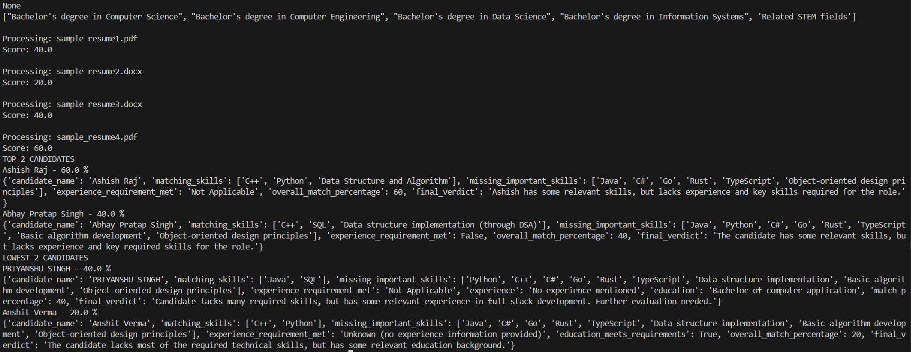

# LLM-Resume-Evaluator (CLI)
An AI-powered Resume Evaluator built using **Python** and **Groq LLM**. The application parses PDF and DOCX resumes, analyzes them against a job description, and ranks candidates based on their overall suitability.
---

## Features
- 📄 Parse PDF and DOCX resumes
- 🤖 Analyze resumes using Groq LLM
- 📋 Extract structured candidate information
- 🎯 Compare resumes with a given job description
- 📊 Generate an overall match score
- 🏆 Rank candidates from best to least suitable

---

## Tech Stack

- Python 3
- Groq API
- Pydantic
- PyPDF
- python-docx
- python-dotenv

---

## Project Structure

```text
LLM-Resume-Evaluator/
│
├── resumes/
├── screenshots/
├── resume_parser.py
├── requirements.txt
├── pyproject.toml
├── .env.example
├── .gitignore
└── README.md
```

---

## Getting Started

### 1. Clone the repository
```bash
git clone https://github.com/<your-username>/LLM-Resume-Evaluator.git
cd LLM-Resume-Evaluator
```
### 2. Create a virtual environment
```bash
python -m venv .venv
```
### 3. Activate the virtual environment
**Windows**
```bash
.venv\Scripts\activate
```
### 4. Install dependencies
```bash
pip install -r requirements.txt
```
### 5. Create a `.env` file
```env
GROQ_API_KEY=your_api_key_here
```
### 6. Add resumes
Place the resumes you want to evaluate inside the `resumes/` folder.

### 7. Run the application
```bash
python resume_parser.py
```

---

## Sample Output



---

## Future Improvements

- Streamlit-based Web UI
- Resume upload interface
- Downloadable evaluation reports
- Support for multiple job descriptions

---
